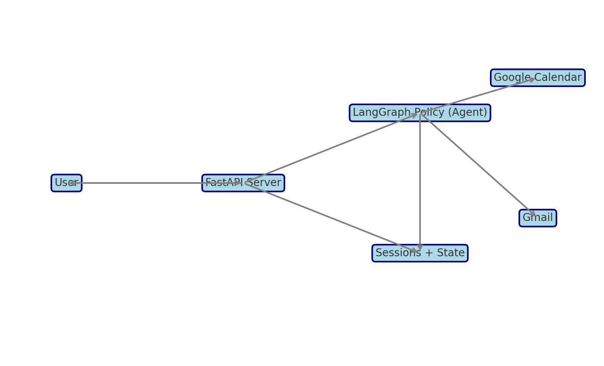
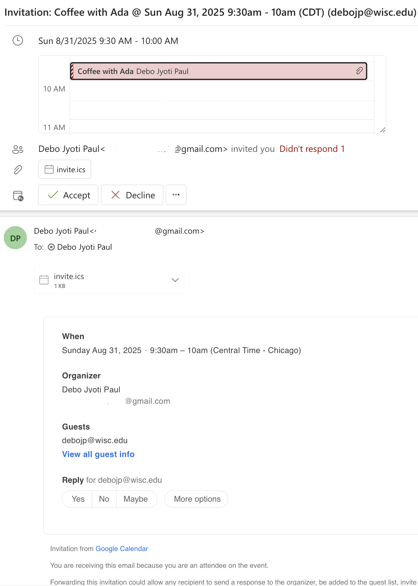

# Calendar + Gmail — Agent Orchestration (w/ LangGraph and Ollama - Phi3:mini)

An agent first calendar assistant that uses natural language for event confirmation.

A focused, simple demo of an **agentic scheduling assistant** that turns natural-language requests into Google Calendar events and sends Gmail confirmations—driven by a constrained LLM policy and a minimal LangGraph workflow.

**Overview**: the LLM picks a single next action; the server enforces confirmation and executes tools; user intent drives optional steps like availability; and successful writes trigger immediate attendee notifications.

The project serves as a demo for agent orchestration with LangGraph, Ollama model setup/usage, Fast API connections all combined with Object-Oritented programming structure.

A simplified architecture image is provided below:


---

## What it is

- A small orchestration layer that lets an LLM **decide one next action** per user turn (fill fields, confirm, create event, send email, or check availability on request).
- **Confirmation first**: the assistant never writes to Calendar without an explicit “yes”.
- **Auto-email** on success: after a successful event create, attendees get a confirmation email by default (skip by saying “no email”).
- **Optional availability**: only checked when asked.

Final Product Example:
---
On your side: Simple text email confirmation | Calendar shows event with local time adjustment.

On attendee side:


## Capabilities (brief)

- Natural-language scheduling (multi-slot extraction in one shot).
- Explicit confirmation before writes.
- Automatic attendee emails after creation.
- Availability checks only when requested.
- Direct tool endpoints for quick smoke tests.

---

## Design & Architecture

**Policy over branches.** A single LLM policy, wrapped in a tiny LangGraph, returns a **strict JSON action** per turn:
`ask | set | confirm | check_availability | create_event | send_email | finish`.

**One model call per turn.** Each `/agent/chat` request makes at most one LLM call. Some turns make **no** model call (e.g., a fast “yes/no” confirmation) for snappy UX.

**Tool layer.**
- `CalendarClient.create_event(...)`
- `GmailClient.send(...)`
- `CalendarClient.get_busy(...)` (used only if the user asks to check availability)

**Confirmation gate.** The policy must emit a `confirm` action before any create. On “yes”, the server executes the write and immediately sends email (unless the user said otherwise).

**Local fast-paths.** Before calling the model, the server performs small, predictable extractions(useful for making agent more predictable):
- attendee emails (regex),
- meeting link (URL),
- US TZ tokens → IANA (`PT/ET/CT/MT` with DST),
- lightweight title inference.

This reduces prompt size and helps the model reach `confirm faster`.

**Time normalization.** Inputs are normalized with `python-dateutil` to ISO 8601. The policy is instructed to interpret relative dates (“tomorrow”, “10–10:30”) and honor explicit TZ tokens.

---

## API

### Start a session
```bash
curl -s -X POST localhost:8000/agent/start
# → {"session_id":"<sid>","reply":"Hi! What should I schedule?"}
```

### Chat: multi-slot in one request
```bash
curl -s -X POST localhost:8000/agent/chat   -H "content-type: application/json"   -d '{"session_id":"<sid>","message":"schedule coffee with Ada tomorrow 10-10:30 PT, add bob@example.com"}'
# → "Create “Coffee with Ada” 2025-08-31T10:00:00–10:30:00 (America/Los_Angeles) with [bob@example.com]? (yes/no)"
```

### Direct tool tests
```bash
# Calendar
curl -X POST localhost:8000/events/create -H "content-type: application/json"   -d '{"title":"Coffee","start_iso":"2025-08-18T10:00:00","end_iso":"2025-08-18T10:30:00","timezone":"America/Chicago","attendees":["you@example.com"]}'

# Gmail
curl -X POST localhost:8000/email/send -H "content-type: application/json"   -d '{"to":["you@example.com"],"subject":"Test","body_text":"Hello."}'
```

---

## Key Implementation Details

- **LangGraph** enforces **one policy step** per request; the server applies the resulting action.
- **Strict JSON policy**: the model must output a minimal schema; server slices/validates and falls back to a simple prompt if malformed.

---

## What changed (and why)

- Replaced ad-hoc, multi-call prompting with a **single-step policy** to cut latency and remove loops.
- Added a **confirmation gate** to prevent accidental writes.
- Made **availability opt-in** to avoid unnecessary API calls and extra turns.
- Trimmed scope: removed mid-turn arbitrary field editing to keep the policy small and reliable.

---

## Constraints, trade-offs, and performance

Natural language scheduling is ambiguous. Relative dates, human time ranges, and DST can be tricky; normalization plus a clear policy helps but won’t catch every corner case. TZ mapping focuses on common US tokens. The model can occasionally return malformed JSON; we harden parsing and fall back gracefully, but a fully structured output mode would be stronger.

Write operations (Calendar/Gmail) are synchronous; errors surface directly, without retries or backoff. Availability checks only see the provided time window. Persistence is intentionally minimal; there’s no durable session store or audit log. Latency depends on local model speed and Google API response times. The design minimizes overhead by doing **one model call per turn** and using **local fast-paths** for confirmations and simple extraction.

---

## Future work (short)

- Intent-specific subgraphs (router + specialized workflows) for more complex domains.
- Durable storage for sessions, metrics, and audit logs.
- Stronger validation & retries for Calendar/Gmail writes; richer conflict handling.
- Broader time/TZ parsing (holidays, locale) and structured-output decoding.
- Background job queue for long or parallel tool calls.

---

## How to run

1. Configure Google auth and clients (`GoogleAuth(ALL_SCOPES)`, `CalendarClient`, `GmailClient`).
2. Start your local model server (e.g., `ollama serve`).
3. Run API:  
   ```bash
   uvicorn app.api.server:app --reload
   ```
4. Use the curl snippets above to interact.

---

## Endpoints

- `POST /agent/start` – begin a chat session
- `POST /agent/chat` – one policy step (and optional tool)
- `POST /agent/end` – end a session
- `POST /events/create` – direct calendar create (debug)
- `POST /email/send` – direct email send (debug)
- `GET  /healthz` – health check
